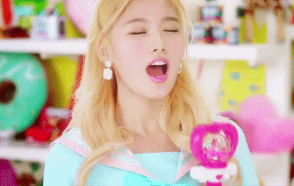
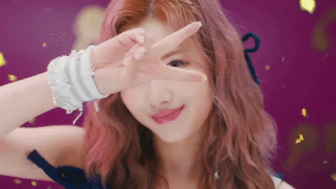
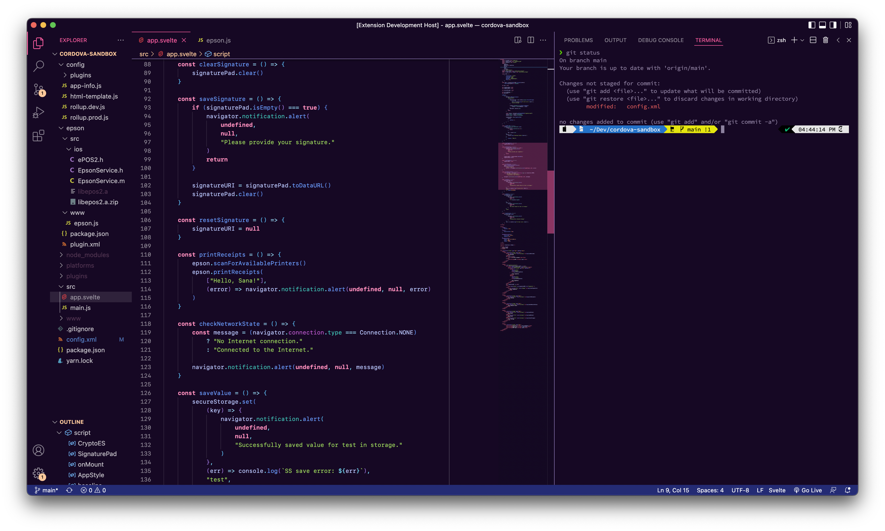

TWICE Lights: Minatozaki
========================

    

A Visual Studio Code theme for fans of Twice whose bias is Sana-chan. 💜

This is my customized theme that I use for my personal projects and at work.
It makes heavy use of Sana-chan’s official color (purple) and
[Twice’s official colors (neon magenta and apricot)](https://twitter.com/jypetwice/status/779329700501913600).
The theme is also inspired by the
[Night Owl](https://marketplace.visualstudio.com/items?itemName=sdras.night-owl)
and
[Tokyo Night](https://marketplace.visualstudio.com/items?itemName=enkia.tokyo-night)
themes.

Screenshot
----------

Supported Languages and Frameworks
----------------------------------

  * JavaScript (and JSON)
    * React
    * Svelte
  * HTML
  * CSS
  * Markdown

If there are any languages that you would like the theme to support, please feel
free to
[file an issue](https://github.com/kristorres/twicelights-minatozaki-vscode-theme/issues).
